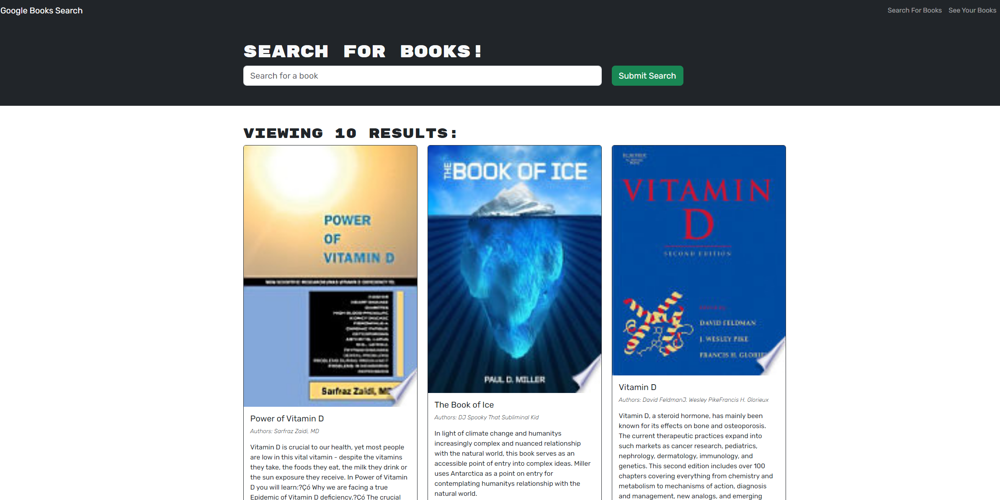

# MERN-Book search 

Protected by a  [License](#license)

Live : https://calm-wave-77448-98e308a41469.herokuapp.com/

## Description

A simple book search where you can save your favrite books

## Table of Contents

- [Credits](#credits)
- [License](#license)
- [Questions](#Questions)

## Credits

Used to make read me https://github.com/jbird11801/ReadMeGenerator

Used apollo server https://www.apollographql.com/docs/apollo-server/

graphql https://graphql.org/

## License

This project has the (MIT) license protecting it!

## Questions

Please contact me about this project here [jarodfredette@gmail.com](mailto:jarodfredette@gmail.com)
            
My git hub account is jbird11801 at https://github.com/jbird11801
